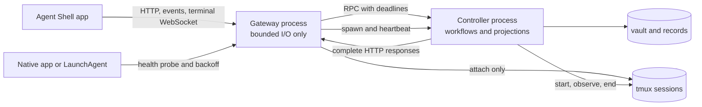

# Agent Shell runtime resilience

Date: 2026-08-24

Agent Shell must use two isolated processes. The gateway serves the app and
terminals. The controller owns durable work, vault projections, and managed
tmux lifecycles. A controller failure must not make a live brain look blank.

Detailed investigation and alternatives: [design record](design-record.md)

## Architecture

The gateway owns port 4321, static assets, server events, and terminal
WebSockets. It keeps the last valid controller snapshot in memory. It never
walks the vault, parses Documents, reconciles records, or classifies every
pane. Terminal attachment talks directly to tmux and stays available when the
controller is slow or restarting.

The controller owns the application capabilities from ADR-0031. It builds
cached projections from vault changes, tmux observations, and persisted
workflow records. The gateway caches each complete successful session response.
Commands use private loopback HTTP with an operation ID and a deadline. A
failed deadline returns an explicit error. It cannot block the gateway event
loop.

The native app or one optional LaunchAgent ensures the gateway exists. It
validates the health identity, probes before every launch, and backs off. The
gateway starts the controller, checks its event-loop heartbeat, and restarts it
with exponential delay. Tmux sessions and durable records remain outside both
processes, so a restart does not end agent work.

The implementation is protected against a working envelope of 200 retained
sessions, 50 panes being observed, 25 attached terminals, and a burst of 100
queued messages. Those numbers are a regression envelope, not a product cap.
Within it, one observation cycle is shared by every caller, tmux subprocesses
are bounded, and concurrent browser invalidations do not multiply vault or
pane scans. The gateway permits one active read of an exact path and at most
64 controller requests. Excess work gets an immediate retryable response.
Telemetry never publishes a state invalidation because a refresh produces
telemetry and would otherwise create a feedback loop.

The vault wire projection excludes derived search strings. The browser already
searches the visible Area, Goal, Document title, and path fields directly, so
sending complete Markdown bodies as hidden `searchText` duplicated work without
adding behavior. The live response fell from 16.21 MB to 3.12 MB without
changing the Document read endpoint.

## Session lifetime

Controller or gateway recovery never ends a tmux session. Existing explicit
workflow transitions keep their current lifetime behavior. This resilience
change does not infer completion, adopt old sessions, or introduce automatic
cleanup. That restraint is deliberate: the capacity envelope proves retained
sessions remain cheap, while a mistaken cleanup is destructive.

Tests are different. Every real-tmux integration test uses a private socket
and destroys only that test server at process exit, including failed fixtures.

## User-visible behavior

The app shows three independent states:

- `Connected`: gateway and controller are current.
- `Work state delayed`: the gateway serves its last snapshot while the
  controller restarts or exceeds its deadline. Existing terminals still work.
- `Terminal unavailable`: the tmux attachment itself failed. The app shows the
  failure instead of an empty black pane.

A terminal displays its last frame until a replacement connection produces a
new frame. A reconnect indicator names the affected layer. A black pane with
no explanation is never a valid loading or error state.

CLI commands have a response deadline and report the failed layer. Mutations
carry an operation ID, and a lost response explicitly says the operation may
have committed and must be inspected before retry. Pipeline advance treats an
exact retry of an already-running live step as success. Startup has one
public-port owner; a second launcher probes the existing gateway and backs off
instead of creating an `EADDRINUSE` restart storm.

## Important decisions

1. **Use process isolation.** The demonstrated CPU loop blocked HTTP and every
   terminal WebSocket. Another module in the same event loop cannot contain
   that failure.
2. **Serve cached projections.** `/api/sessions` must not rebuild the vault or
   rescan all panes. The controller publishes changes. The gateway returns the
   last complete version in bounded time.
3. **Never couple recovery to session cleanup.** Process supervision may kill
   only Agent Shell processes. Existing tmux sessions and durable records are
   outside the recovery boundary.
4. **Retain last-known-good state.** A tmux timeout or controller restart makes
   the session projection stale, not empty. The response labels that state.
5. **Bound work, not session count.** Pane capture, message delivery, request
   bodies, queues, retries, and restart attempts all have explicit capacity and
   time budgets. Overload returns a visible delayed or busy result; it never
   creates an unbounded process fan-out or retry loop.
6. **Bound refresh amplification.** Telemetry cannot invalidate the projection
   that produced it. The gateway rejects duplicate or over-capacity controller
   work, and projections carry only fields the browser consumes.

## Representative flow

An implementation agent runs pipeline step 2 and calls `tangent goal handover`.
The controller writes the handover and marks step 2 complete. It creates step 3
or notifies the brain. The gateway continues to stream the brain throughout
this work. If the controller loops, the gateway serves its cached projection,
restarts the controller, and leaves every tmux session intact.

## Risks and unknowns

- Gateway/controller IPC is limited to readiness and heartbeats. Private
  controller HTTP and cached response shapes can change atomically.
- The reproduced `brain advance` failure was an infinite retry loop in session
  naming: appending a retry suffix and then truncating it repeatedly produced
  the same occupied 60-character name. Name allocation must reserve suffix
  space and terminate after a bounded number of attempts. The same path also
  performed unnecessary vault-wide projection; targeted reads remove that
  amplification risk. Process isolation still protects terminals from future
  unknown controller loops.
