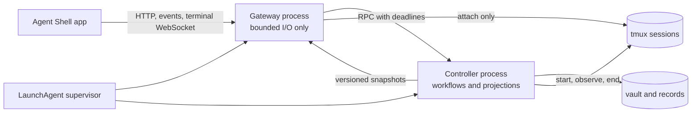
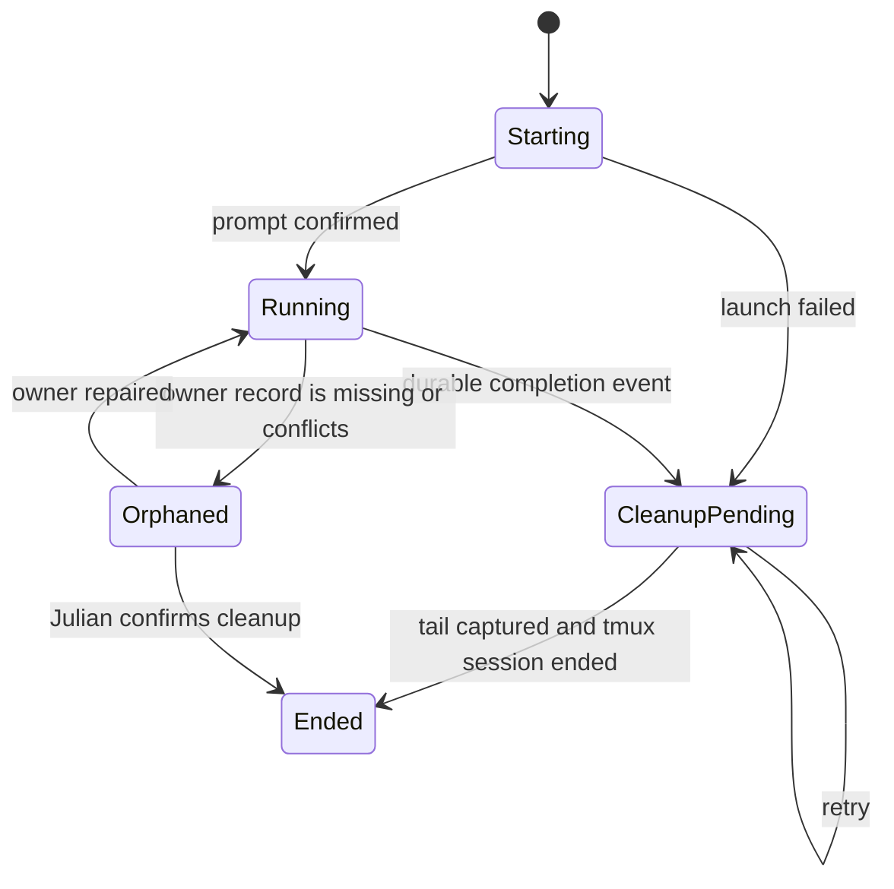

# Agent Shell runtime resilience

Date: 2026-08-24

Agent Shell must use two isolated processes. The gateway serves the app and
terminals. The controller owns durable work, vault projections, and managed
tmux lifecycles. A controller failure must not make a live brain look blank.

Detailed investigation and alternatives: [design record](design-record.md)

## Architecture

The gateway owns port 4321, static assets, server events, and terminal
WebSockets. It keeps the last valid controller snapshot in memory. It never
walks the vault, parses Documents, reconciles records, or classifies every
pane. Terminal attachment talks directly to tmux and stays available when the
controller is slow or restarting.

The controller owns the application capabilities from ADR-0031. It builds one
cached projection from vault changes, tmux observations, and persisted workflow
records. It publishes a versioned snapshot to the gateway. Commands use RPC
with an operation ID and a deadline. A failed deadline returns an explicit
error. It cannot block the gateway event loop.

The supervisor starts both processes. It checks event-loop heartbeats and
restarts either child independently. Tmux sessions and durable records remain
outside both processes, so a restart does not end agent work.

## Managed session lifetime

Only sessions created by Tangent are eligible for automatic cleanup. Each has
a stable run ID, owner kind, and owner record. Tangent never infers ownership
from a session name.

A completion event is explicit:

- A pipeline step hands over successfully.
- A solo worker reports completion to its brain.
- A brain hands over after the next generation is ready.
- Julian stops work, or closes the Goal through an authorized flow.
- A launch fails after it creates a session.

The controller first persists the handover, next-step state, notice, and
`cleanup-pending` state. It then captures a bounded final pane tail and ends the
exact tmux session. Cleanup is idempotent and resumes after controller restart.
The worker does not remain alive merely because a Goal or pipeline record is
complete.

Brains are different. A current brain remains alive between messages. It ends
only on self-handover after the replacement is ready, explicit stop, or a
recorded terminal failure.

Unmanaged sessions and inconsistent sessions enter `orphaned`. Tangent shows
them for repair or confirmed cleanup. It does not destroy them automatically.
Tests use a separate tmux socket and always destroy that isolated server at
suite end.

## User-visible behavior

The app shows three independent states:

- `Connected`: gateway and controller are current.
- `Work state delayed`: the gateway serves its last snapshot while the
  controller restarts or exceeds its deadline. Existing terminals still work.
- `Terminal unavailable`: the tmux attachment itself failed. The app shows the
  failure instead of an empty black pane.

A terminal displays its last frame until a replacement connection produces a
new frame. A reconnect indicator names the affected layer. A black pane with
no explanation is never a valid loading or error state.

## Important decisions

1. **Use process isolation.** The demonstrated CPU loop blocked HTTP and every
   terminal WebSocket. Another module in the same event loop cannot contain
   that failure.
2. **Serve cached projections.** `/api/sessions` must not rebuild the vault or
   rescan all panes. The controller publishes changes. The gateway returns the
   last complete version in bounded time.
3. **Clean up from explicit lifecycle events.** Goal status alone is not enough
   authority. The managed run record names the exact session and durable event
   that permits cleanup.
4. **Preserve evidence, not processes.** Before cleanup, Tangent stores a
   bounded final pane tail and links to the provider transcript when known.
   Completed tmux sessions are not an archive.
5. **Quarantine ambiguity.** Missing records, old unmarked sessions, and
   ownership conflicts require repair or Julian's confirmation. Automatic
   cleanup applies only to positively identified managed sessions.

## Representative flow

An implementation agent runs pipeline step 2 and calls `tangent goal handover`.
The controller writes the handover and marks step 2 complete. It creates step 3
or notifies the brain, then records cleanup for step 2. The cleanup worker saves
the last pane tail and ends only step 2's session. The gateway continues to
stream the brain throughout this work. If the controller loops, the supervisor
restarts it and retries the cleanup record.

## Risks and unknowns

- The IPC format and snapshot schema become durable enough for independent
  process restart. They need version checks, but not long-term external API
  compatibility.
- Existing sessions have no stable run ID. Migration must classify them as
  managed only when their tmux options and durable records agree. All others
  start as orphaned.
- The exact regular expression that caused the 2026-08-24 CPU loop is still
  unknown. Process isolation removes its product-wide effect. Profiling and
  input bounds are still required to remove the loop itself.

