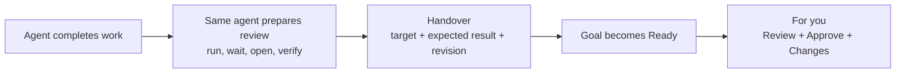

# Agents prepare completed work for review

Date: 2026-08-25

Goal: [[goal-make-completed-work-directly-testable]].

Detailed evidence: [repository record](design-record.md). Vault copy: [[design-record-make-completed-work-directly-testable]].

## Proposal

The agent that finishes the work must also prepare it for Julian to review.

This preparation happens in the agent's final work turn, before `tangent handover`. It stays inside the same Goal pipeline.

The agent decides which steps the result needs. Tangent does not define a universal setup recipe.

| Result | What the work agent does |
|---|---|
| Polez change | Run `plz cdev`, wait for Polez, open the exact route, and verify the change |
| JavaScript app | Start the server, wait until it responds, open the exact page, and verify the change |
| Existing web page | Open the link and verify that it shows the completed result |
| File or report | Open the exact file and verify that it contains the completed result |
| No setup | Verify the existing Tangent result or session |

The agent uses the repository instructions and its normal tools. Project-specific knowledge stays with the agent that works in that project.



## The worker contract

Every final work assignment includes this outcome:

> Before you hand over completed work, prepare it for Julian to review.
>
> Use the repository instructions and your normal tools. Start each required service. Wait until the target works.
>
> Open the exact target and verify it against the completed revision.
>
> Report the target, expected result, source revision, and each process that must stay running.

Agent Shell adds this contract to the prompt for the last planned pipeline step. The brain does not write the project commands.

If the brain adds another step later, the new last worker gets the same contract. That worker verifies the prepared result again.

The instruction defines the result, not the commands. The agent chooses `plz cdev`, a JavaScript server, a direct link, or no setup.

If the work agent cannot prepare the result, it reports the error. The brain sends repair work instead of creating a review Request.

A separate setup worker is a fallback. It is not a required pipeline stage.

## Processes that must stay running

If a server must survive the work turn, the agent runs it as a Tangent Program. The Program owns the command, folder, session, and live state.

If a Program exists, the agent starts it. If no Program exists, Agent Shell must let the worker add one.

The work agent still waits for the real page and verifies it. A live process does not prove that the correct page works.

## What Julian sees

The work enters `For you` only after the agent prepares and verifies the review target.

```text
Polez · Ready
Class-like dim enums

[ Review → ]    Accept this result?  [Approve] [I want these changes]
```

`Review` opens the prepared page, app, file, Document, or session. It never runs an arbitrary agent command.

Julian does not run setup commands, find a worktree, choose a port, or reconstruct the route.

If a required process stops later, the work stays visible. `Review` changes to `Repair review`, and the brain sends repair work.

This model adds one standard outcome to every work assignment. It does not add a new Request state or a Review Environment object.
