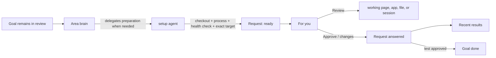

# Prepared review requests

Date: 2026-08-25

Tangent should ask Julian to review a result only after an agent has prepared
the review environment. The agent goes to the right checkout, starts or reuses
the required processes, checks the route, and gives the Request one action that
opens the result. Julian should arrive at the thing to judge, not at setup
instructions.

Detailed investigation and alternatives: [design record](design-record.md)

## The model

`For you` means **work that is ready for Julian now**. A Request remains the
brain's durable question; it is not a Goal and does not become a second work
item. The only new distinction is whether the Request's handoff is ready.



A Request has three useful states:

- `preparing`: recorded, but not shown in `For you` because Julian cannot act
  yet;
- `ready`: its question and any promised review target have been checked, so
  it appears in `For you`;
- `answered`: Julian's answer is durable, the row leaves `For you`, and a
  compact receipt appears in `Recent results`.

`ready` exists to protect the meaning of `For you`. Process startup and route
checks can fail or take time. An open question is not necessarily an actionable
question. Plan and text-only decision Requests can be ready immediately;
visible Test Requests normally pass through preparation.

Request state and Goal state stay independent. A Goal can remain open and
reviewed while its Test Request is preparing or ready. Only approval of that
Goal-bound Test Request closes the Goal, as it does now. A failed setup changes
the Request, not the Goal.

## What Julian sees

A ready Test row should be shorter than today's modal and make the prepared
handoff primary:

```text
Polez · Test
Class-like dim enums
Schema editor is running from branch enums.

[ Review → ]                         [Approve] [I want changes]
```

`Review` opens the exact target supplied by the preparation agent. For a web
result this is the checked URL; for another result it can reveal a file or open
an existing Tangent session. Tangent does not open a browser merely because a
Request became ready: that can steal focus, open several tabs, or launch while
Julian is away. One click performs the handoff and preserves user intent.

The detail view shows only useful confidence:

- what is ready and what Julian should judge;
- the target and checkout/branch when that identity matters;
- process state and a clear `Retry setup` route when preparation failed;
- `Open setup session` for diagnosis, not a pasted command recipe.

While preparation runs, it belongs with the Goal's current activity, for
example `Preparing review…`; it does not increment the `For you` count. A
failed preparation appears on the Goal and goes back to the brain to recover.
It does not ask Julian to become the operator unless the failure requires a
real decision or permission.

`Recent results` is a small, collapsible receipt list below `For you`. It keeps
recent answered Requests long enough to confirm what just disappeared, reopen
the reviewed target, and see whether Julian approved or requested changes. It
is not a permanent inbox or a second history system; the durable Request record
remains the source of truth.

## How agents prepare without a rigid framework

The brain owns the handoff, but delegates setup like any other substantive
work. The default brain guidance becomes:

> Before a visible Test Request becomes ready, delegate whatever preparation
> makes the result directly reviewable. Reuse the Area's Resources and named
> Programs. Ask the worker to verify the exact target and report it. If no
> setup is useful, make the Request ready directly.

This is guidance, not a mandatory pipeline stage. The Area remains the place
for local knowledge:

- `Resources` identifies the repository or worktree.
- A Program names a repeatable server, watcher, or command.
- Ordinary Area prose can explain product-specific review details that an
  agent needs.

For the enum example, the brain can delegate: use the recorded worktree, start
the existing development Program (or run the repository's documented command),
wait for health, navigate to the schema editor, and report the exact URL. The
worker marks the Request ready with that URL and the live Program identity.
Nothing in Agent Shell needs to understand Polez, enum schemas, npm scripts, or
route construction.

Programs are preferred when the operation is reusable because Tangent can show
and reuse their live state. They are not required. A worker may perform a
one-off setup in its visible session and report the same checked handoff. This
keeps the feature useful before every Area has polished Programs.

## Decisions to challenge

1. **One Request model, with readiness.** Do not add a separate Review, Demo,
   Environment, or Approval object. The material fact is whether Julian can act
   on the existing Request.
2. **The brain coordinates; a worker prepares.** This preserves the brain's
   orchestration boundary and leaves project-specific judgment with an agent
   that can inspect the repository.
3. **Area knowledge plus Programs, not a review-recipe DSL.** Tangent records
   the resulting handoff, not a universal setup workflow. Add structure later
   only for repeated variation that Programs cannot express.
4. **One-click opening, not automatic opening.** Readiness may occur in the
   background or in batches. Julian chooses when Tangent takes focus.
5. **A checked target, not setup prose, is the contract.** Instructions can be
   supporting detail, but a visible Test is not ready if its promised target
   has not been reached and checked.
6. **Recent results is a receipt, not work state.** It prevents the current
   “the row vanished; did that register?” problem without diluting `For you`.

## Risks and unknowns

- A URL health check does not prove the feature is usable. The preparation
  agent must check the review route at the same level a competent handoff
  requires; Tangent should record its claim, not pretend to verify arbitrary
  product semantics.
- A process can die after readiness. Agent Shell should derive current Program
  liveness when it can and change the action to `Repair review` if the known
  dependency stops. Unknown one-off dependencies can only fail when opened.
- Worktrees can become stale or disappear. The handoff keeps the checkout
  identity needed to diagnose that case, but the Goal and Area remain the
  authorities for source and repository ownership.
- The first version should support web URLs, files, and Tangent sessions. A
  generic shell command as a user-facing launch target would create a new
  execution and permission surface and is intentionally excluded.
