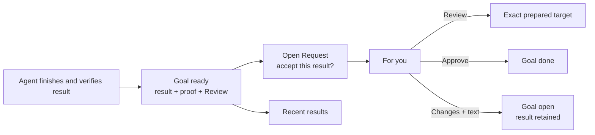

# Prepared results

Date: 2026-08-25

Goal: [[goal-make-completed-work-directly-testable]].

Detailed investigation: [repository record](design-record.md). Vault copy: [[design-record-make-completed-work-directly-testable]].

## Recommendation

Tangent must prepare the finished result before it asks Julian to review it.

The prepared handoff belongs to the result, not the Request. The Request asks Julian to accept that exact result revision.

This keeps the product model small:

- `For you` contains open Requests that Julian can answer now.
- A Request is one durable ask. It remains `open`, `answered`, `withdrawn`, or `superseded`.
- A Goal becomes `ready` after its result, proof, and Review action exist.
- `ready` belongs to the Goal. It does not become a second Request state.
- `Recent results` recalls finished results and opens their output. It is not a list of Request receipts.



Preparation remains ordinary Goal work. A failed server start or missing file does not create a half-ready Request.

The current Goal row shows `Preparing review` while an agent repairs the handoff. The row names the brain as the recovery owner.

## What Julian sees

A finished result has one primary action: `Review`.

```text
Polez · Ready to validate
Class-like dim enums
Schema editor is open on the reviewed commit.

[ Review → ]       Accept this result?  [Approve] [I want these changes]
                    [Details]
```

`Review` opens the exact target. `Details` shows the result identity, proof, numbered steps, and expected behavior.

The answer actions stay separate from `Review`. Opening the result never accepts it.

Tangent opens nothing at result readiness. Julian controls the focus change and can receive several results without tab noise.

If a known dependency stops, the row stays in `For you`. `Review` becomes `Repair review`, and the brain receives the failure.

Repair prepares the same result again. It does not answer the Request or change the Goal state.

## One Review action, several safe openers

Julian sees one concept. Agent Shell uses a small set of safe adapters at the system boundary.

| Result | Review action | Preparation evidence |
|---|---|---|
| Web | Open the exact HTTP route | The agent reached the route and verified the visible state |
| Native app | Focus an app or open its deep link | The agent opened the same target and verified the app state |
| File | Open the exact file or Tangent Document | The agent verified the file, viewer, and reviewed revision |
| No setup | Open the result, Document, or Tangent session | The agent exercised that action before publication |

Review actions cannot contain shell text. The server accepts only typed URLs, scoped files, Tangent identities, and declared application targets.

Any long-lived server or watcher must be a Program. Programs own commands, working folders, sessions, and live state.

The result stores only Program references. It never copies Program state or embeds a setup recipe.

If no Program exists, the agent adds one through the Program boundary. It does not leave an untracked background process behind.

Programs do not store routes, review steps, or expected behavior. Those facts belong to the result that the agent verified.

## Who prepares the result

The agent that finishes or reviews the work prepares the first handoff. This agent already knows the checkout, result, and proof.

The brain publishes the ready result and its Request after it reads the handover. A worker does not mutate Request state.

If preparation needs separate work, the brain delegates a repair assignment. This is an exception, not a mandatory pipeline stage.

The worker must report these facts:

- the exact source revision and checkout.
- the Review action.
- the numbered steps and expected behavior.
- the verification time.
- each required Program.

Agent Shell validates the action and references. The agent remains responsible for the claim that the product state is correct.

## Runtime rules

A result revision locks the code or artifact that Julian will judge. A Request identifies that revision.

A repair can update the location or verification time only while result content stays identical. A content change creates a new result revision.

Program liveness is always derived from Programs. A running tmux session is not proof that an HTTP route or native screen is usable.

Agent Shell must not restart a stale Program and immediately claim success. A worker must verify the restored target before `Review` returns.

Answering a Request does not stop shared Programs. Program lifetime remains an Area decision.

## Decisions to challenge

1. **Prepare the result before the Request.** Existing Goal and pipeline state already records preparation. A `preparing` Request adds duplicate lifecycle state.
2. **Put Review on the result.** Recent results and ready Goals need output access despite failed Request creation or delivery.
3. **Require Programs for long-lived dependencies.** An agent shell with an unmanaged background server cannot provide reliable liveness or repair.
4. **Use one Review action with constrained adapters.** Do not expose arbitrary shell commands or create user-facing target types.
5. **Let the finishing agent prepare first.** A mandatory setup worker adds latency and loses useful checkout context.
6. **Keep Recent results result-based.** An answered Request is an event. The finished output is the thing Julian needs to recall.

## Material product decision

The local opener is the one new privilege boundary. This design recommends typed adapters for URLs, scoped files, Tangent targets, and declared apps.

A URL-only first version is safer, but it fails the native and file cases that this design must cover.

Julian must decide whether a deliberate `Review` click can use the controlled local opener. It never authorizes arbitrary commands.

## Risks

- A prepared target can become stale. Tangent can prove Program state, but only an agent can verify product behavior.
- Some native apps cannot reopen an exact screen. Those results stay in preparation until an agent creates a reliable focus or deep-link action.
- A missing Program blocks publication for process-backed reviews. The Program creation path must be available to workers.
- The approved ready-Goal and Recent-results model is not implemented yet. This design depends on that model and must not add a competing shortcut.
