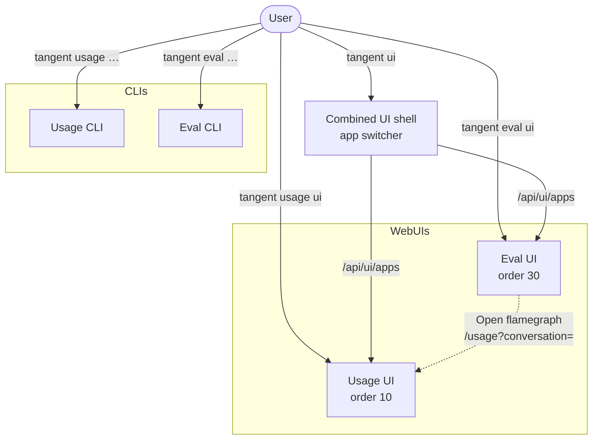
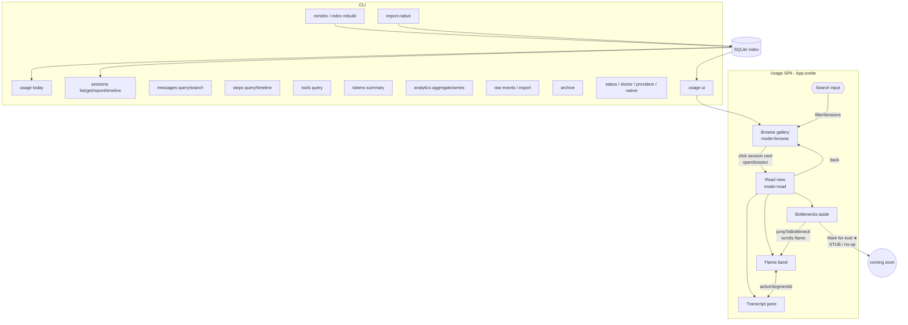
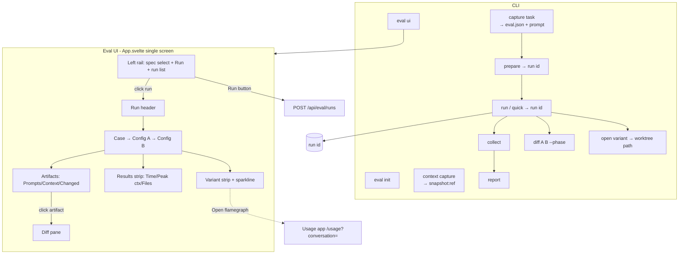

# Tangent UX Map

Every user touchpoint across the two product surfaces — **Usage**, **Eval** — drawn as a graph, plus the common workflows that thread through them. "Touchpoint" means anything a user acts on: a CLI command or flag, a clickable element, a search/filter input, an HTTP endpoint.

Source of truth: this is reverse-engineered from the code. File:line references are inline so each node is traceable.

---

## 0. The shell that ties them together

Two front ends, one shell. Each surface ships a CLI, and both Usage and Eval ship an embedded web UI mounted inside one combined browser shell.

### Entry points

| You type | What starts | Source |
|---|---|---|
| `tangent <surface> …` | the surface's CLI | `src/cli/index.ts:66-94` |
| `tangent-usage` / `tangent-eval` | the standalone per-surface CLI bin | each package `package.json` `bin` |
| `tangent ui [usage\|eval]` | combined browser shell (app switcher) | `src/cli/index.ts:56`, `src/cli/product.ts:208` |
| `tangent usage ui` / `tangent eval ui` | that surface's UI server, standalone | `usage/src/cli/ui.ts`, `eval/src/cli/commands/ui.ts` |
| `tangent open {agent\|project\|setup}` | a terminal/agent session | `src/cli/product.ts:76-97` |
| `tangent setup` / `status` / `doctor` / `completion` | cross-surface config & health | `src/cli/product.ts`, `src/cli/index.ts` |

### Shell internals

- **App switcher** (`tangent-ui/src/App.svelte:121-136`): a `Switch Tangent app` button → menu listing installed apps. Click an app → `selectApp()` → URL pushState → mounts that app's `mountApp` bundle.
- **Discovery**: apps self-register via `tangent.uiApp` in their `package.json` (`src/cli/ui-discovery.ts:136`). Usage = order 10, Eval = order 30.
- **Server** (`ui-server/src/index.ts`): `/healthz`, `/api/ui/apps` (the app list), `/api/*` route dispatch, static + Vite-dev asset mounts.

The only cross-surface UI edge is **Eval → Usage**: the "Open flamegraph" link jumps from a variant's metrics into that conversation's Usage telemetry.

---

## 1. Usage surface

Local conversation telemetry. CLI (`tangent usage`) + a single-page Svelte UI with two modes (browse gallery → read view). No MCP. Spec: `usage/src/cli/spec.ts`.

### 1.1 Graph

### 1.2 CLI touchpoints

Handlers: `usage/src/cli/usage.ts`, `resource-commands.ts`, `ui.ts`. Nearly all take `--json`; resource commands also take `--repo`, `--provider claude|codex|all`, `--source native|all|usage-jsonl`, `--format json|csv|vega-lite`.

| Command | Args / key flags | Does | Line |
|---|---|---|---|
| `init [repo]` | `--provider` | Check native capture capability | `usage.ts:68` |
| `status [repo]` | `--verbose` | Capture health + capability coverage | `usage.ts:75` |
| `ui [session\|latest]` | `--repo --scope --host --port --no-browser --static-ui --provider --source` | **Start UI server, open browser** (the CLI→UI bridge) | `ui.ts:5` |
| `today [repo]` | `--provider --source` | Today's sessions, reverse-chron | `usage.ts:89` |
| `session <id\|latest>` (hidden) | — | One session summary | `usage.ts:107` |
| `report <id\|latest>` (hidden) | — | Assistant-centered report | `usage.ts:120` |
| `transcript <id\|latest>` (hidden) | `--internal` | Readable transcript | `usage.ts:133` |
| `reindex [repo]` (hidden) | `--provider --force --source` | **Rebuild SQLite index** | `usage.ts:184` |
| `export [repo]` | `--since --until --provider --source` | Normalized events → JSONL | `usage.ts:202` |
| `events [repo]` (hidden) | — | Raw normalized events JSON | `usage.ts:214` |
| `doctor [repo]` (hidden) | `--trace` | Verbose diagnostics | `usage.ts:301` |
| `index rebuild [repo]` | `--force --provider --source` | Write SQLite index | `resource-commands.ts:11` |
| `providers list` / `inspect 
` | — | Provider capabilities | `:21` `:27` |
| `sessions list [repo]` | `--provider --date --since --until --source --format` | Filterable session list | `:33` |
| `sessions get/report <id>` | — | Session detail / report | `:45` `:51` |
| `sessions timeline <id>` | `--metric duration\|self-duration\|tokens\|cost --group … --format vega-lite` | Timeline / chart spec | `:57` |
| `messages query` | `--session --role --min-chars --contains --limit --format` | Filter messages | `:68` |
| `messages search <query>` | `--provider --limit` | Full-text search | `:83` |
| `steps query` | `--session --kind --order --limit` | Query steps | `:93` |
| `steps timeline` | `--session --metric` | Step timeline | `:106` |
| `tools query` | `--session --name --include-results none\|preview\|full --limit` | Query tool calls | `:116` |
| `tokens summary` | `--by model\|provider\|session\|step-kind --session` | Token breakdown | `:129` |
| `analytics aggregate` | `--group (rep) --metric (rep)` | Aggregate | `:140` |
| `analytics series` | `--bucket day\|hour --group --metric` | Time series | `:150` |
| `raw events` | `--session --kind --ndjson` | Raw events | `:160` |
| `native schemas / inspect <path> / status` (hidden) | — | Native log introspection | `usage.ts:243-264` |
| `archive [repo]` (hidden) | `--before <date>` (req) `--dry-run --provider` | **Move old telemetry to archive** | `usage.ts:267` |
| `import-native [repo]` (hidden) | `--provider` | **Import transcripts + reindex** | `usage.ts:285` |

### 1.3 UI clickables (`usage-ui/src/App.svelte`)

- **Browse**: session card button → `openSession` → read view (`:452`).
- **Read top bar**: `← All conversations` back (`:471`); session-id chip `⧉` → copy to clipboard (`:476`); zoom `−` / `+` / level label (`:490-492`).
- **Flame band**: turn prompt button → `activateRow` (`:508`); per-step segment button → `activateSegment` (`:519`); empty-turn segment (`:535`). Bottleneck segments marked visually.
- **Transcript pane**: "Thinking" `
` (`:569`); `Show full message`/`Show less` toggle (`:574`); "Proposed plan" `
` (`:596`); tool `Details`/`Hide` toggle → reveals command/dir/output (`:602`).
- **Bottlenecks aside**: `◀` prev / `▶` next (`:648`); bottleneck row → `jumpToBottleneck` → activates segment + scrolls flame (`:656`); `★ Mark for eval` → **no-op stub** (`:666`).

### 1.4 Search / filter / sort

- **Search input** (`:447`, "Project or session") → `filterSessions` client-side on title/provider/model, and the same `query` scopes the loaded conversation fetch.
- **Sort**: no UI control. Sessions server-sorted `lastActivityAt desc`. Bottlenecks pre-ranked by data layer.
- **Keyboard shortcuts**: none.

### 1.5 Endpoints (`usage/src/server/index.ts`, all GET, `/api/usage/*`)

| Endpoint | Wired in UI? | Line |
|---|---|---|
| `/selection` | indirect | `:188` |
| `/sessions?provider&limit` | **yes** (gallery + 2s poll) | `:192` |
| `/sessions/:id` | latent | `:201` |
| `/sessions/:id/cockpit` | latent | `:202` |
| `/sessions/:id/conversation-view?query&limit` | **yes** (read view) | `:205` |
| `/sessions/:id/timeline-view` | latent | `:211` |
| `/sessions/:id/timeline?metric` | latent | `:217` |
| `/sessions/:id/transcript?includeTools` | latent | `:220` |
| `/messages/selection` | latent | `:225` |
| `/providers` | latent | `:232` |

`:id` accepts `latest`/`selected`. **Only 2 of 10 endpoints are exercised by the UI** — the rest, plus `getSession.nextActions` hrefs (timeline/compare/evidence/rollup/export), are dormant. Live update: server watches native transcript dirs and rebuilds in place; client polls every 2s (`LIVE_REFRESH_MS`) and swaps only on signature change, preserving scroll.

---

## 2. Eval surface

Coding-agent eval prepare/run/collect/report. CLI (`tangent eval`) + a single-screen master-detail Svelte UI behind a read-only `/api/eval/*` server. Spec: `eval/src/cli/spec.ts`.

### 2.1 Graph

### 2.2 CLI touchpoints (`eval/src/cli/spec.ts`)

Shared agent flags (`commands/shared.ts`): `--agent manual|codex-cli|claude-cli`, `--model gpt-5.4|gpt-5.4-mini|sonnet|haiku|opus`, `--command`, `--profile`, `--sandbox read-only|workspace-write|danger-full-access`, `--permission-mode`, `--timeout-ms`.

| Command | Args / key flags | Does | Line |
|---|---|---|---|
| `init` | — | Create `./evals` dir | `spec.ts:17` |
| `context capture <name>` | `--repo --cwd --include-ancestors --include-dirty-context --from-ref --empty` | Snapshot context → `snapshot:<ref>` | `spec.ts:19` |
| `capture task <id>` | `--prompt <path\|-> (req) --repo --repo-ref --cwd --context --variant (rep) --phases` + agent flags | Scaffold `evals/<id>/eval.json` + prompt | `spec.ts:39` |
| `prepare <eval.json>` | `--json` | Create worktrees + context commits → run id | `spec.ts:59` |
| `run [eval.json]` | `--repo --repo-path --prompt (rep) --context (rep) --phases` + agent flags | Prepare+run+collect, live progress | `spec.ts:60` |
| `quick` | (= run shortcut, needs `--prompt`) | One-shot, no spec file | `spec.ts:74` |
| `collect <run-id>` | `--json` (`latest` ok) | Collect git + usage metrics | `spec.ts:87` |
| `report <run-id>` | `--json` | Collect + print compact report | `spec.ts:88` |
| `diff <run-id> <A> <B>` | `--phase context\|plan\|impl\|all --case` | git diff / range-diff (CLI compare) | `spec.ts:89` |
| `open <run-id> <variant>` | `--case` | Print variant worktree path | `spec.ts:98` |
| `ui [run-id\|latest]` | `--host --port --no-browser --json` | Start UI server | `spec.ts:99` |

Run-id resolves `latest`/`selected` (`commands/shared.ts:71`). All run-producing commands feed one `run id` consumed downstream.

### 2.3 UI clickables (`eval-ui/src/App.svelte`)

- **Spec `<select>`** (`:347`) — pick spec to launch.
- **`Run` button** (`:357`) → `launch` → `POST /api/eval/runs {specPath}` → re-list + select new run. Label → "Starting…".
- **Run list buttons** (`:369`) → `selectRun(id)` → `loadRun`.
- **Case `<select>`** (`:401`) → resets variants, recompare.
- **Config A `<select>`** (`:409`) / **Config B `<select>`** (`:417`) → `loadCompare` when both set.
- **Variant cards A/B** (`:427`, display) with sparkline bars (`:435`).
- **"Open flamegraph" link** (`:440`) → `/usage?conversation=<id>` → **leaves Eval into Usage**.
- **Results-strip rows** (`:449`, display) — Time / Peak context / Files changed with good/bad delta badges.
- **Artifact buttons** — Prompts (`:469`), Context files (`:482`), Changed files (`:495`) → `selectArtifact` → `loadDiff`.
- **Diff pane** (`:507`) — side-by-side add/delete/changed/equal rows.

No menus, tabs, modals, hover-expand, or sortable columns. No keyboard shortcuts. No free-text search — filtering is by selection (run → case → A/B → artifact). Sorting is server-fixed.

### 2.4 Endpoints (`eval/src/server/index.ts`, `/api/eval/*`)

| Method + path | Returns | Line |
|---|---|---|
| `GET /selection` | newest run with variants | `:138` |
| `GET /specs` | spec dropdown data | `:139` |
| `GET /runs` | run list + status counts | `:142` |
| `POST /runs` | 202 + runId; **prepares+runs+collects detached** | `:133` |
| `GET /runs/:runId` | full run detail | `:146` |
| `GET /runs/:runId/compare?caseId&left&right` | both variants + artifact same/changed badges | `:147` |
| `GET /runs/:runId/diff?caseId&left&right&kind&path` | line diff for one artifact | `:148` |

`:runId` accepts `selected`/`latest`. While any variant is `prepared`/`running`, the UI polls `getRun` every 1500ms then reloads compare.

---

## 3. Common workflows

### Cross-surface

1. **Eval → Usage flamegraph dive**: run an eval → in the Eval UI pick run/case/Config A vs B → scan Results strip → click **Open flamegraph** on a variant → land in the Usage read view for that conversation → inspect flame/transcript/bottlenecks. The one wired cross-surface edge.

### Usage

2. **First-run setup**: `tangent setup --usage` → `tangent usage status` → `tangent usage reindex` → `tangent usage today`.
3. **Triage today (CLI)**: `usage today` → copy id → `usage transcript <id>` / `report <id>` → `sessions timeline <id> --metric duration --format vega-lite`.
4. **Visual bottleneck hunt (UI)**: `usage ui` → search project → click card → read view → click slowest bottleneck (flame auto-scrolls, transcript re-scopes) → expand tool Details → back.
5. **Live monitoring**: open `usage ui` on a running agent → file-watch + 2s poll surface new turns without losing scroll.
6. **Export / archive**: `usage export --since --until` (or `tangent data export`); cleanup `usage archive --before <date> --dry-run` then for real.

### Eval

7. **Scaffold → run → compare**: `eval init` → `eval capture task <id> --prompt … --variant a:repo --variant b:snapshot:<ref>` → `eval ui` → pick spec → Run → poll → compare A/B artifacts/metrics.
8. **One-shot quick**: `eval quick --prompt p.md --context repo --context snapshot:<ref> --agent codex-cli` → `eval report latest` or `eval ui latest`.
9. **Manual prepare**: `eval prepare eval.json` → run agents by hand in printed worktrees → `eval collect <id>` → `eval report <id>`.
10. **Deep CLI compare**: `eval run eval.json` → `eval diff <id> a b --phase impl` (range-diff) + `eval open <id> a` to cd in.
11. **Context A/B**: `eval context capture base --from-ref HEAD` → reference `snapshot:<ref>` in a `--variant`/`--context` to compare with-vs-without context.

---

## 4. Notable gaps (model these as soft/dormant edges)

- **Usage UI uses only 2 of 10 endpoints.** The other 8, plus `getSession.nextActions` hrefs (timeline/compare/evidence/rollup/export), are latent. `★ Mark for eval` is a no-op stub.
- **No keyboard shortcuts anywhere**, in either UI. All interaction is pointer/native-form.
- **Search exists only in Usage** (one client-side gallery filter). Eval has no free-text search — it filters by selection and uses fixed server-side sort.

---

*Generated from source. Key files: `src/cli/{index,product,ui-discovery}.ts`, `ui-server/src/index.ts`, `tangent-ui/src/App.svelte`; per surface: `{usage,eval}/src/cli/spec.ts`, `{usage,eval}/src/server/index.ts`, `{usage-ui,eval-ui}/src/App.svelte`.*
